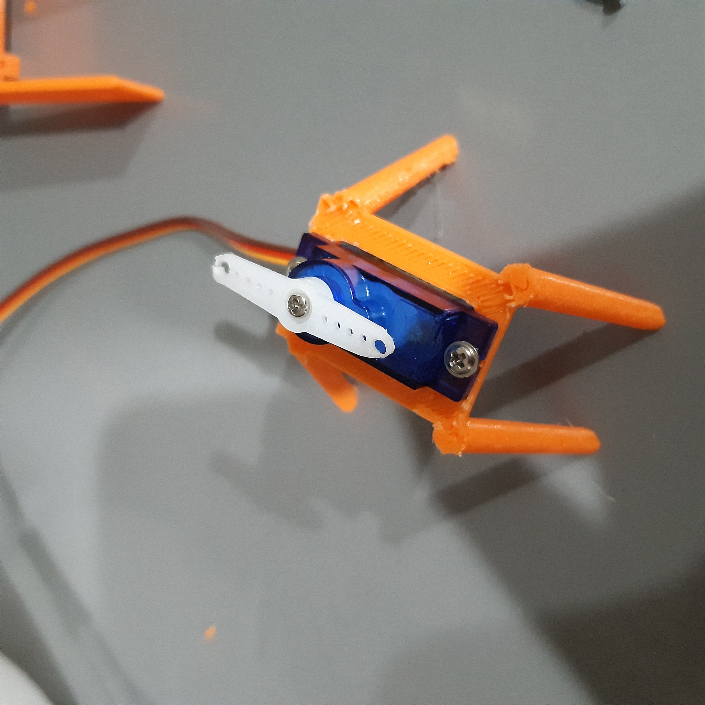
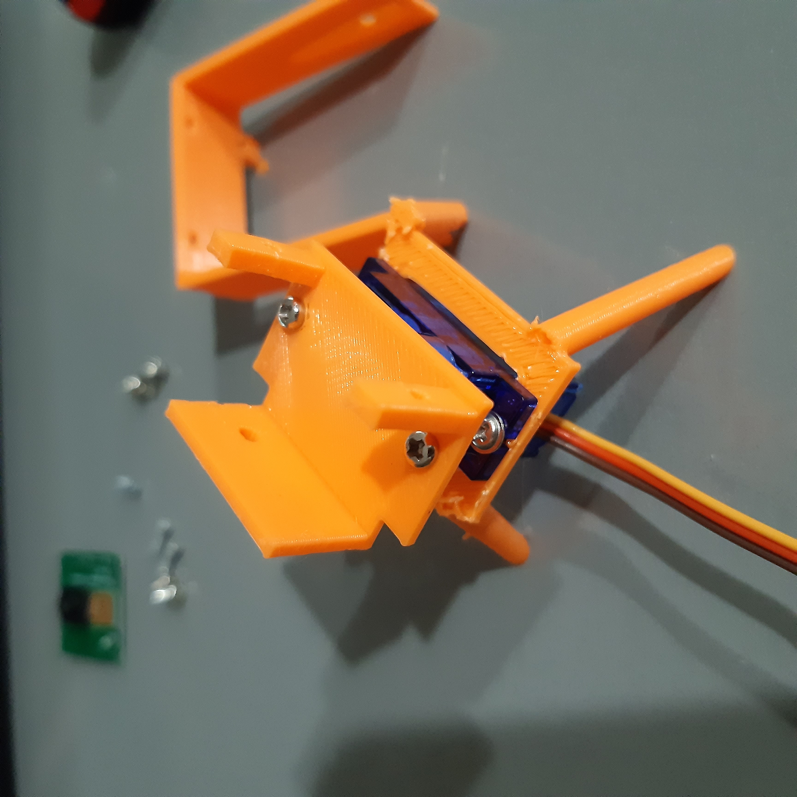
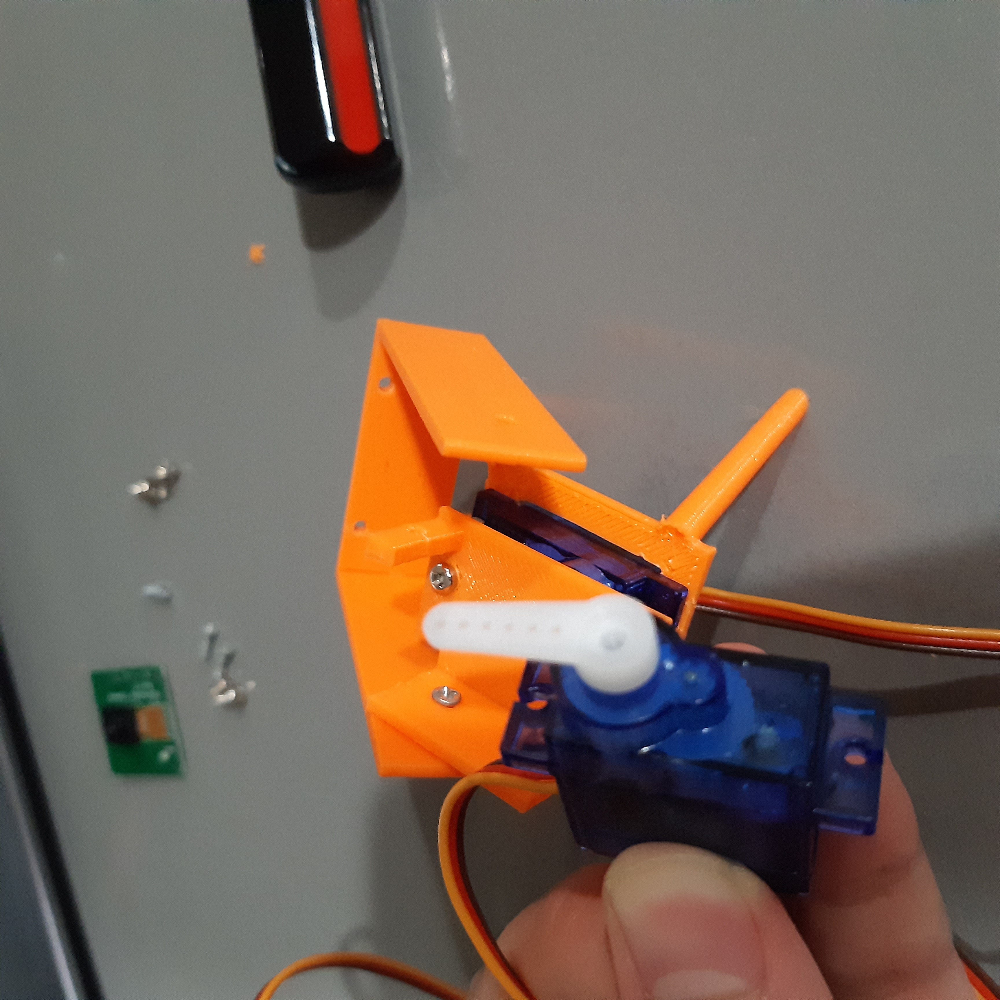
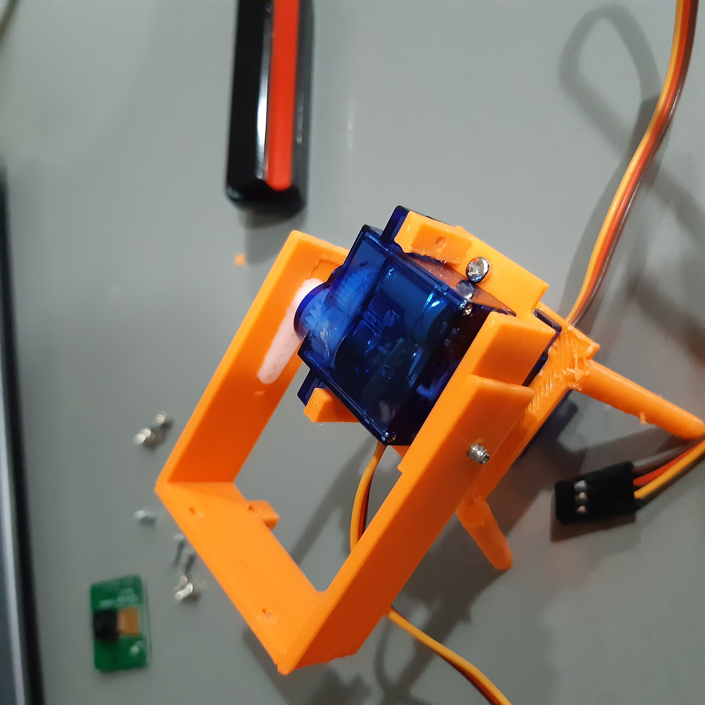
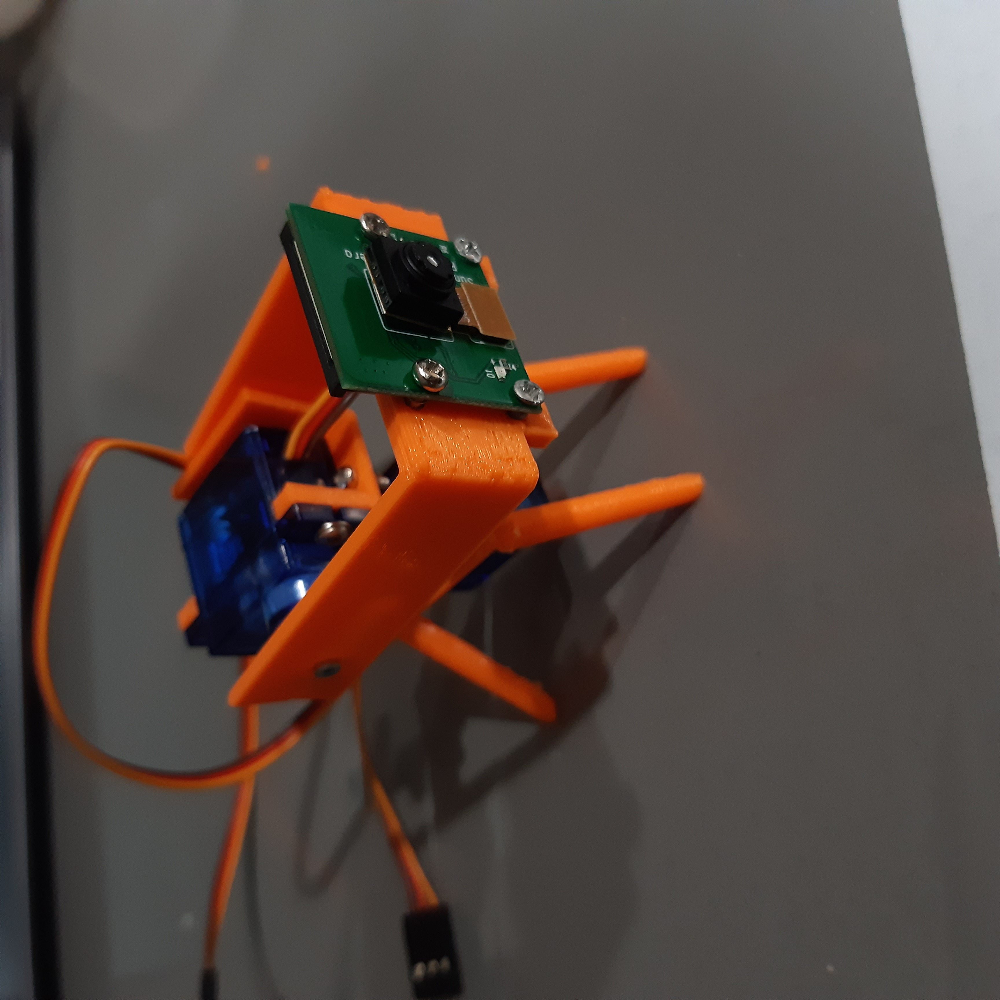

# Servo-PanTilt-PiCam
I decided to make a Pan-tilt Servo mount for the Raspberry Pi Camera. It is ment for the common 9g servos. I first thought of this to use in Paul McWhorter's Raspberry Pi class, put know maybe I might use it in a few of my own projects as well. I've included all the 3D Models and code. Use this however you like! Enjoy!

First, print out the cad files. 

Then I got one of my servos, and put it in the quadropod mount where the wires are facing the back \(the front is where the 2 legs point forwards\). I then screwed it in with the 2 long screws servos come with. 

Then I programmed the servo to be at 90 degrees because now we put the horn \(the 2 sides one\). I customized this horn \(trimming about 1-2 millimeters from either end and driling a wider hole\) to fit in the horn slot in the servo mount. The slot in the servo mount is too small for this horn. Next, I screwed in the horn with the small screw. 

Then, I screwed in the panMount to the horn of the servo with 2 screws of the right diameter. Make sure to use screwes that have a small base, or else the next servo won't fit in place.

After this, it gets a bit complicated. You first need to screw in the tilt mount to it's hole and then orient it in such a way, that you'll have room to put the next servo in. 

Then program the 2nd servo to be in 60 degrees and put it's small horn in facing parallel.  

Next, put the 2nd servo in it's position on the mount, where the wires come out the front. and also put the horn in it's slot on the tilt mount.

This is when you screw in the horn for the second servo. However, you have to get a new screw that is the same radius as the given one, but longer. 

Then, I screwed in one of the long screws that came with the 2nd servo on the back mount:

I then programmed the servo to be at 180 degrees for me to screw in the other one. 

And finally, we screw in the Pi Camera. Now the screw holes are kind of delicate, so make sure to use thin screws and be gentle. 

AND DONE!! ENJOY!!!!
